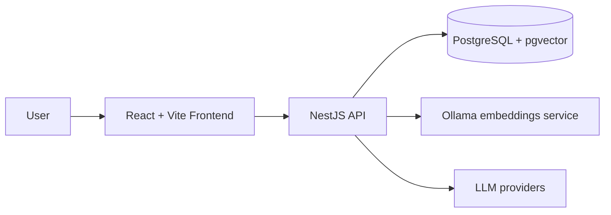

# Ai-Chatbot

Ai-Chatbot is a full-stack application for authenticated chat sessions with AI-assisted memory extraction. The project combines a NestJS backend, a React/Vite frontend, and supporting infrastructure for PostgreSQL, pgvector, and Ollama.

## Features

- User registration, login, and token-based authentication
- Session-based chat workflows with message history
- Per-user API key management for LLM providers
- Session memory extraction using embeddings and LLM prompts
- Responsive web experience for chat and dashboard views

## Architecture overview



## Tech stack

- Backend: NestJS, TypeScript, Drizzle ORM, PostgreSQL, JWT, Argon2
- Frontend: React, Vite, TypeScript, TanStack Query, Zustand, Tailwind CSS
- Infrastructure: Docker Compose for PostgreSQL and Ollama

## Repository structure

```text
backend/      NestJS API and database layer
frontend/     React/Vite client application
docker-compose.yml  Local services for Postgres and Ollama
```

## Quick start

1. Install dependencies in the backend and frontend folders.
2. Start the local database and Ollama services.
3. Run the backend and frontend development servers.
4. Open the app in your browser and sign in or register.

## Documentation links

- Backend guide: [backend/README.md](./backend/README.md)
- Frontend guide: [frontend/README.md](./frontend/README.md)
