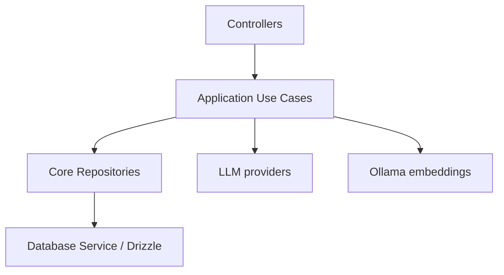

# Backend

## Overview

The backend is a NestJS application that powers authentication, session-based chat, API key storage, and memory extraction for the application. It uses a layered architecture with controllers in the interface layer, application use cases, domain-style repositories in the core layer, and infrastructure modules for database access and LLM integrations.

## Tech stack

- NestJS 11 with TypeScript
- Drizzle ORM and PostgreSQL
- JWT-based authentication with refresh-token rotation and CSRF protection
- Argon2 for password hashing
- Docker Compose for local Postgres and Ollama services
- Jest for testing and ESLint for linting

## Architecture overview



## Folder structure

```text
src/
  application/      Use cases for auth, chat, memory, and user flows
  core/             Domain entities, models, repositories, and shared types
  infrastructure/    Database, modules, LLM providers, Ollama integration
  interface/        Controllers and DTOs for HTTP endpoints
  shared/           Guards, decorators, errors, filters, config helpers
```

## Prerequisites

- Node.js 20+
- pnpm
- Docker and Docker Compose
- PostgreSQL and Ollama services (or the provided Docker Compose setup)

## Installation

```bash
cd backend
pnpm install
cp .env.example .env
```

## Environment variables

The backend validates its runtime configuration through the environment schema in the application config module. The following variables are used or documented by the repository:

| Variable                       | Required | Notes                                                                |
| ------------------------------ | -------- | -------------------------------------------------------------------- |
| PORT                           | Yes      | HTTP port for the NestJS server                                      |
| DB_HOST                        | Yes      | PostgreSQL host                                                      |
| DB_PORT                        | Yes      | PostgreSQL port                                                      |
| DB_USER                        | Yes      | PostgreSQL username                                                  |
| DB_PASSWORD                    | Yes      | PostgreSQL password                                                  |
| DB_NAME                        | Yes      | PostgreSQL database name                                             |
| JWT_ACCESS_SECRET              | Yes      | Secret used to sign access tokens                                    |
| JWT_REFRESH_SECRET             | Yes      | Secret used to sign refresh tokens                                   |
| JWT_ACCESS_TOKEN_EXPIRES_IN    | Yes      | Access token lifetime                                                |
| JWT_REFRESH_SESSION_EXPIRES_IN | Yes      | Refresh token lifetime                                               |
| LLM_SECRET                     | Yes      | Shared secret used by LLM-related flows                              |
| OLLAMA_URL                     | Yes      | Ollama service base URL                                              |
| OLLAMA_EMBED_MODEL             | Yes      | Embedding model name                                                 |
| OLLAMA_EXTRACT_MODEL           | No       | Present in the example env file; currently not validated in the code |
| OLLAMA_PORT                    | No       | Used by Docker Compose to expose Ollama locally                      |

## Running locally

```bash
cd backend
docker compose up -d db ollama
pnpm run migrate:up
pnpm run dev
```

The API will be available on the port defined by PORT (default: 3000).

## Available scripts

```bash
pnpm run build
pnpm run dev
pnpm run start
pnpm run lint
pnpm run test
pnpm run test:e2e
pnpm run migrate:up
pnpm run migrate:down
pnpm run migrate:create
```

## Database

The application uses PostgreSQL with the pgvector extension for embeddings.

### Drizzle and migrations

- Drizzle ORM is configured through the database service in the infrastructure layer.
- SQL migrations live in [migrations/migrations](./migrations/migrations).
- The migration runner is implemented in [migrations/migration.js](./migrations/migration.js).

### Current schema

- users
- sessions
- api_keys
- messages
- embeddings

### Seeding

No dedicated seed script is currently present in the repository.

## API overview

The backend currently exposes the following routes through Nest controllers:

### Auth

- POST /api/auth/register
- POST /api/auth/login
- POST /api/auth/refresh

### User

- GET /api/user
- POST /api/user/apiKeys
- GET /api/user/me

### Sessions

- POST /api/sessions
- GET /api/sessions
- GET /api/sessions/:id
- POST /api/sessions/:id/message
- POST /api/sessions/:id/memory

Swagger/OpenAPI documentation is not configured yet. This is a TODO for a future iteration.

## Authentication overview

Authentication is enforced through a global guard. Protected routes expect a Bearer access token in the Authorization header. The login and refresh flow also sets refresh and CSRF cookies for session renewal.

## Error handling

The backend uses NestJS exceptions for common failures such as unauthorized access, not found resources, and bad requests. It also includes domain-specific error handling helpers and exception filters under the shared filters layer for auth and user-related concerns.

## Logging

Logging is currently lightweight and uses console output in a few places. There is no centralized structured logger configured yet.

## Testing

The repository includes a Jest setup and an e2e test scaffold under [test](./test). Unit tests for the use cases are not yet present in the current codebase.

## Code style / conventions

The project follows a clear NestJS structure:

- controllers live under the interface layer
- business logic is grouped into application use cases
- repositories and entities live in the core layer
- infrastructure-specific integrations live in infrastructure modules

ESLint is configured for the backend workspace.

## Deployment notes

No deployment manifests or production deployment configuration are included in this repository yet. The local Docker Compose setup is intended for development and testing only.
